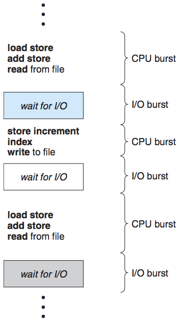

# Session 4: Scheduling of threads

In the previous sessions you have learnt what a thread is, how to create one and how to create multiple threads. But can the total running time of this execution be optimised? This chapter is going to introduce scheduling as a possible optimisation. 

    The objectives of this session are:

    - To introduce CPU scheduling, which is the basis for multiprogrammed operating systems.
    - To understand the difference between process scheduling and thread scheduling.

## Assignments

In a single-processor system, only one process can run at a time. Others must wait until the CPU is free and can be rescheduled. The objective of multiprogramming is to have some process running at all times, to maximise CPU utilisation. The idea is relatively simple. A process is executed until it must wait, typically for the completion of some I/O request. In a simple computer system, the CPU then just sits idle. All this waiting time is wasted; no useful work is accomplished. With multiprogramming, we try to use this time productively.

Several scheduling algorithms exists. CPU scheduling deals with the problem of deciding which of the processes in the ready queue is to be allocated the CPU. You can find some scheduling algorithms below.

- First-Come, First-Served Scheduling (FCFS)
- Shortest-Job-First Scheduling (SJF)
- Priority Scheduling
- Round-Robin Scheduling (RR)
- Multilevel Queue Scheduling
- Multilevel Feedback Queue Scheduling

### 4.1

In order to schedule processes fairly, a round-robin scheduler generally employs time-sharing, giving each job a time slot or quantum (its allowance of CPU time), and interrupting the job if it is not completed by then. The job is resumed next time a time slot is assigned to that process. In the absence of time-sharing, or if the quanta were large relative to the sizes of the jobs, a process that produced large jobs would be favoured over other processes. Round Robin algorithm is a pre-emptive algorithm as the scheduler forces the process out of the CPU once the time quota expires. You will use Round-Robin as a scheduling algorithm in this assignment.

Use your your solution to assignment 3.2 and change the scheduling method. The threads must have different priorities and use Round-Robin as the desired scheduling method. Implement this assignment such that you can show that the priorities are changed and have indeed influenced the way of executing the code.

    The objectives are:

    - Update your 3.2 solution to use round-robin to schedule work
    - Investigate the influence of priorities of the threads under RR

### 4.2
By far the simplest CPU-scheduling algorithm is the first-come, first-served (FCFS) scheduling algorithm. With this scheme, the process that requests the CPU first is allocated the CPU first. The implementation of the FCFS policy is easily managed with a FIFO queue. This assignment has the same objectives as assignment 4.1. The only difference is that you will be utilising the FCFS scheduling algorithm as apposed to the Round-Robin scheduling algorithm.

    The objectives are:

    - Write an implementation of FCFS to influence your threads. You are *not* allowed to use the pthread FIFO 
      scheduler for this assignment.
    - Being able to explain in detail the difference between FCFS and other scheduling algorithms!

If you plan on using the pthread library for this, make sure you study the examples in the man page for scheduling carefully.

### Bonus Questions

Below you will find three questions. If you answer all these questions correctly, you will be rewarded a bonus! Draft an essay that consists of a title page and **one** page for the answers to the questions. Your essay should exists of three sections, each section covering a question. You can use `4_bonus.tex` as a template for your solutions. This file can be compiled with Latex. Furthermore, you should **clearly explain** why your answer is the correct one and why the others are incorrect. **Plagiarism checks will be conducted!**

#### Question 1

Which of the following scheduling algorithms could result in starvation?
You will have to explain in your essay which one(s) could result in starvation.

* first-come, first-served
* Shortest job first
* Round Robin
* Priority

#### Question 2

Consider a variant of the RR scheduling algorithm in which the entries in the ready queue are pointers to the PCBs.

**a).** What would be the effect of putting two pointers to the same process in the ready queue?

**b).**What would be two major advantages and two disadvantages of this scheme?

**c).**How would you modify the basic RR algorithm to achieve the same effect without the duplicate pointers?

#### Question 3

Consider the scheduling algorithm in the Solaris operating system for time-sharing threads.

**a).** What is the time quantum (in milliseconds) for a thread with priority 15? With priority 40? **Explain why!**

**b).** Assume that a thread with priority 50 has used its entire time quantum without blocking. What new priority will the scheduler assign this thread?  **Explain why!**

**c).** Assume that a thread with priority 20 blocks for I/O before its time quantum has expired. What new priority will the scheduler assign this thread?  **Explain why!**

